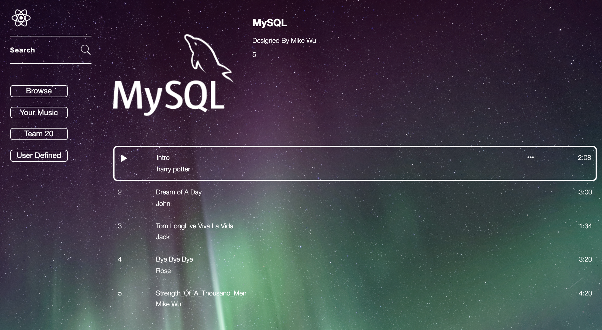

# CS157A Team-20

Team Members:
Johnny Phenglavong,
Khoa Pham
& Yu Xiao Zheng

---

### `Create a database for our team20`
- create team-20 table
`CREATE DATABASE IF NOT EXISTS team20;`
---
### `first we implement a streaming music project `
- some icon color:
`#07D159`
---

---

### after login,

---

### updating the newest functioning...

---

### updating UI with Login Register

---
### `Register UI`

---

---

---

- now can play a song under the background [Still Testing...]
- 

- can output the album pic and song's title, artist
- but still a little mistake
