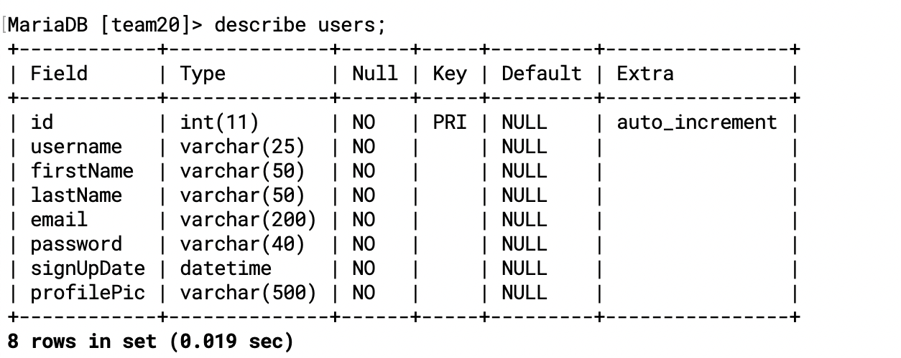
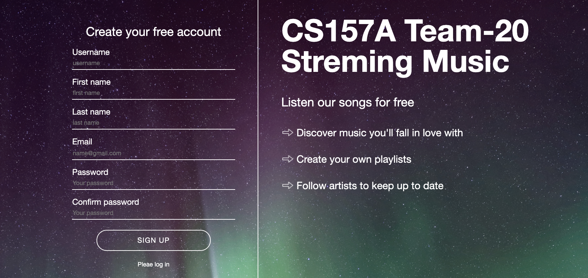

# CS157A Team-20

Team Members:
Johnny Phenglavong,
Khoa Pham
& Yu Xiao Zheng

---

### `Create a database for our team20`
- create team-20 table
`CREATE DATABASE IF NOT EXISTS team20;`
---

---
- create a table

```sql
CREATE TABLE `users` (
  `id` int(11) NOT NULL AUTO_INCREMENT,
  `username` varchar(25) NOT NULL,
  `firstName` varchar(50) NOT NULL,
  `lastName` varchar(50) NOT NULL,
  `email` varchar(200) NOT NULL,
  `password` varchar(40) NOT NULL,
  `signUpDate` datetime NOT NULL,
  `profilePic` varchar(500) NOT NULL,
  PRIMARY KEY (`id`)
) ENGINE MyISAM;
```
---


### `first we implement a streaming music project `
- some icon color:
`#07D159`
---

### `Login UI`

---

### `Register UI`

---

---


### after login,

---

### updating the newest functioning...

---

### updating UI with Login Register

---

---


